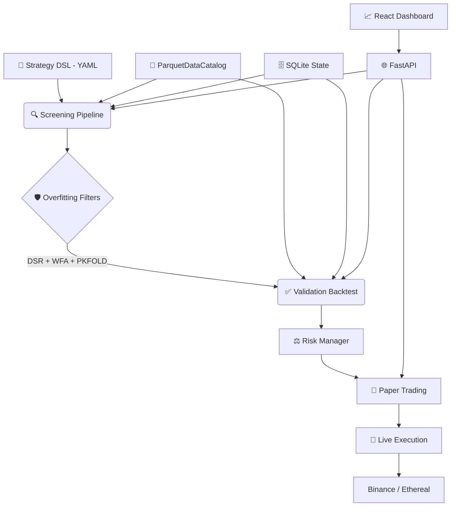

# 🌊 vibe-quant

**The high-performance algorithmic trading engine built on rigorous math, realistic simulation, and pure vibes.**

[](https://opensource.org/licenses/MIT)
[](https://www.python.org/downloads/)
[]()
[]()

---

## 🚀 The Mission

**Most backtesters lie to you.** They ignore funding rates, assume perfect liquidity, and encourage overfitting strategies to historical noise.

**vibe-quant** is an institutional-grade framework designed to be brutally honest. It uses a single engine — **NautilusTrader** (Rust core) — in two modes: fast screening for parameter sweeps and full-fidelity validation with realistic execution. Leverage, funding rates, and liquidation are modeled even during screening. If a strategy survives `vibe-quant`, it stands a fighting chance in the real world.

**Core Philosophy:**
1. 🧘 **Code flows, money grows.** (Developer experience > Enterprise bloat)
2. 🎯 **Reality first.** (Fees, slippage, latency, funding rates, and liquidation are first-class citizens)
3. 🛡️ **Death to overfitting.** (Rigorous statistical validation is default, not optional)

---

## ✨ Key Features

### 🏗️ Single-Engine, Two-Tier Architecture
* **Screening Mode:** NautilusTrader with simplified fills + multiprocessing parallelism for rapid parameter sweeps — still models leverage, funding rates, and liquidation.
* **Validation Mode:** Full-fidelity NautilusTrader with custom `FillModel` (volume-based slippage), `LatencyModel` (co-located 1ms → retail 200ms), and complete cost modeling.

### 📝 Strategy DSL
* **Declarative YAML** — define strategies as Indicator + Condition + Action combos.
* **Multi-timeframe** — 1m, 5m, 15m, 1h, 4h confirmation signals.
* **Time filters** — restrict trading to specific sessions/timezones.
* **Auto-compilation** — DSL compiles to NautilusTrader `Strategy` subclasses. Same code for backtest, paper, and live.

### 💸 Realistic Simulation (The "Anti-Rekt" Layer)
* **True Cost Analysis:** Maker/taker fees, volume-based slippage (square-root market impact), dynamic spreads.
* **Leverage Logic:** Native support for up to **20x leverage** with:
    * Maintenance margin tiers and liquidation price calculation.
    * **Funding Rate Payments** (8-hour for Binance, 1-hour for Ethereal).
* **Network Latency Simulation:** NautilusTrader `LatencyModelConfig` with presets (co-located, domestic, international, retail, custom).

### 🛡️ Overfitting Prevention Pipeline
* **Deflated Sharpe Ratio (DSR):** Bailey & Lopez de Prado formula — determines if your Sharpe is skill or multiple-testing luck.
* **Walk-Forward Analysis:** Sliding window train/test (9m/3m/1m default → ~13 windows over 2 years).
* **Purged K-Fold CV:** Cross-validation with purge gaps to prevent data leakage. Each filter independently toggleable.

### ⚡ Execution & Connectors
* **Binance Futures:** Full USDⓈ-M Perpetual support via NautilusTrader adapter.
* **Ethereal DEX:** Custom adapter with **EIP-712** signed authentication.
* **Paper Trading:** NautilusTrader `TradingNode` on Binance testnet — **zero code changes** from backtest to live.
* **Bankroll Management:** Kelly Criterion, Fixed Fractional, and ATR volatility sizing (pluggable `PositionSizer` modules).

### 🧬 Automated Strategy Discovery
* **Genetic/Evolutionary Optimization** — automatically discovers indicator combos.
* **Strategy genome** — chromosomes of (indicator, parameter, condition) genes.
* **Multi-objective fitness** — Pareto ranking on Sharpe, MaxDD, Profit Factor with complexity penalty.
* **Overfitting-aware** — DSR correction for total candidates tested, WFA required for final promotion.

### 📊 Dashboard & Analytics
* **React frontend** (Vite + shadcn/ui + Recharts) — 7 pages: strategy management, backtest launch, results analysis, paper trading, discovery, data management, settings
* Visual strategy editor with YAML sync, split view, and 6-step wizard
* Equity curves, drawdown charts, trade distribution, Pareto scatter, performance radar
* Real-time WebSocket dashboards for discovery and paper trading
* Multi-run comparison, CSV/JSON export, auto-save notes
* Code-split bundle: 87KB initial load, lazy-loaded routes

---

## 🛠️ Tech Stack

| Layer | Technology |
|-------|-----------|
| 🐍 **Language** | Python 3.13 (via `uv`) |
| ⚙️ **Engine** | NautilusTrader ~1.222.x (Rust core) |
| 📊 **Indicators** | NautilusTrader built-in (Rust) + pandas-ta-classic |
| 💾 **Market Data** | NautilusTrader ParquetDataCatalog (Apache DataFusion) |
| 🗄️ **Raw Archive** | SQLite (immutable CSV/API data archive) |
| 📋 **State** | SQLite (WAL mode) — configs, results, trade logs |
| 🔍 **Analytics** | DuckDB (ad-hoc queries on Parquet + SQLite) |
| 📈 **Frontend** | React 19 + Vite 7 + shadcn/ui + Recharts |
| 🌐 **API** | FastAPI + Uvicorn |
| 📱 **Alerts** | Telegram Bot API |

---

## 📦 Getting Started

### Prerequisites

- Python 3.13+
- [`uv`](https://docs.astral.sh/uv/) package manager
- Node.js 20+ and `pnpm` (for frontend)

### Install

```bash
# Clone the vibes
git clone https://github.com/verebelyin/vibe-quant.git
cd vibe-quant

# Backend
uv pip install -e ".[dev]"

# Frontend
cd frontend && pnpm install && cd ..
```

### Start the Application

```bash
# Terminal 1: Start the FastAPI backend
uvicorn vibe_quant.api.app:app --reload --port 8000

# Terminal 2: Start the React frontend
cd frontend && pnpm dev
# Opens at http://localhost:5173 (proxies /api to backend)
```

Or use the Makefile:
```bash
cd frontend
make dev       # Start Vite dev server
make build     # Production build
make test      # Run vitest
make lint      # Run biome check
make typecheck # Run tsc --noEmit
make e2e       # Run Playwright E2E tests
```

### Download Market Data

```bash
# Download 2 years of OHLCV + funding rates for BTC, ETH, SOL
vibe-quant data ingest --symbols BTCUSDT,ETHUSDT,SOLUSDT --years 2

# Or specify exact date range
vibe-quant data ingest --symbols BTCUSDT --start 2025-01-01 --end 2025-12-31

# Verify data quality
vibe-quant data status
```

### Run a Screening Sweep

```bash
vibe-quant screening --run-id 1
```

### Run Tests

```bash
# Backend
pytest
./scripts/check_quality_blocking.sh
./scripts/check_quality_style_debt.sh

# Frontend
cd frontend && pnpm test
```

`check_quality_blocking.sh` is the CI-blocking runtime gate.
`check_quality_style_debt.sh` reports full-repo lint/type debt without blocking merges.

---

## 🏛️ Architecture

See [docs/architecture.md](docs/architecture.md) for detailed architecture documentation.

```
Strategy DSL (YAML) → Screening (NT simplified, parallel) → Overfitting Filters → Validation (NT full fidelity) → Paper → Live
```



---

## 🗂️ Project Structure

```
vibe_quant/
├── data/           # Data ingestion, archival, catalog management
├── db/             # SQLite state management (WAL mode)
├── dsl/            # Strategy DSL parser, validator, compiler
├── screening/      # Parameter sweep pipeline (multiprocessing)
├── validation/     # Full-fidelity backtesting (custom fills, latency)
├── overfitting/    # DSR, Walk-Forward, Purged K-Fold filters
├── risk/           # Position sizing, risk actors, circuit breakers
├── discovery/      # Genetic/evolutionary strategy optimizer
├── paper/          # Paper trading on Binance testnet
├── ethereal/       # Ethereal DEX adapter (EIP-712)
├── api/            # FastAPI backend (routers, models)
├── dashboard/      # Streamlit UI (legacy, being retired)
├── jobs/           # Background job management
├── logging/        # Structured event logging
├── alerts/         # Telegram notifications
└── strategies/     # Example YAML strategies

frontend/               # React frontend (Vite + shadcn/ui)
├── src/
│   ├── routes/         # Page components (7 pages)
│   ├── components/     # UI components by domain
│   ├── api/generated/  # Auto-generated API hooks (Orval)
│   ├── hooks/          # WebSocket + custom hooks
│   └── stores/         # UI state
├── e2e/                # Playwright E2E tests
└── Makefile            # Dev workflow targets
```

---

## 🖥️ CLI

```bash
# Data management
vibe-quant data ingest --symbols BTCUSDT,ETHUSDT,SOLUSDT --years 2
vibe-quant data ingest --symbols BTCUSDT --start 2025-01-01 --end 2025-12-31
vibe-quant data status

# Screening (parameter sweep)
vibe-quant screening --run-id <N>

# Validation (full-fidelity backtest)
vibe-quant validation run --run-id <N> --latency retail

# Overfitting filters
python -m vibe_quant.overfitting run --run-id <N> --filters wfa,dsr,pkfold

# Paper trading
python -m vibe_quant.paper --config paper_config.json

# Dashboard (React frontend + FastAPI backend)
uvicorn vibe_quant.api.app:app --port 8000 &
cd frontend && pnpm dev
```

---

## 🗺️ Roadmap

Development follows an **8-phase implementation plan** detailed in [`SPEC.md`](SPEC.md).

- [x] **Phase 1: Foundation & Data Layer** — ingestion, archival, ParquetDataCatalog
- [x] **Phase 2: Strategy DSL & Screening Pipeline** — YAML parser, compiler, parallel sweeps
- [x] **Phase 3: Validation Backtesting & Risk** — custom fills, latency, sizing, risk actors
- [x] **Phase 4: Overfitting Prevention** — DSR, Walk-Forward, Purged K-Fold
- [x] **Phase 5: Dashboard** — React frontend (migrated from Streamlit)
- [x] **Phase 6: Paper Trading & Alerts** — Binance testnet, Telegram
- [x] **Phase 7: Ethereal DEX Integration** — custom adapter, EIP-712
- [x] **Phase 8: Automated Strategy Discovery** — genetic optimization

---

## ⚠️ Disclaimer

**Risk Warning:**
Trading cryptocurrencies with leverage involves high risk. Leverage can work against you as well as for you.

**Software Disclaimer:**
`vibe-quant` is open-source software for educational and research purposes only.
1. **No Financial Advice:** Nothing in this repository constitutes financial advice.
2. **Simulation vs. Reality:** Paper trading results have inherent limitations beyond programmed models.
3. **Use at Your Own Risk:** The authors accept no liability for any loss or damage arising from use of this software.

*Never risk more than you can afford to lose.*
