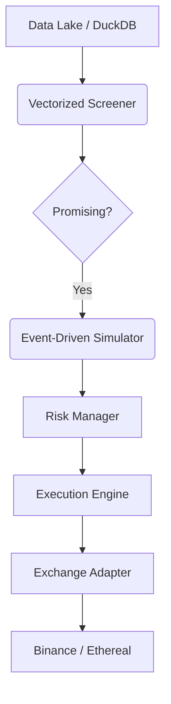

# 🌊 vibe-quant

**The high-performance algorithmic trading engine built on rigorous math, realistic simulation, and pure vibes.**

[](https://opensource.org/licenses/MIT)
[](https://www.python.org/downloads/)
[]()
[]()

---

## 🚀 The Mission

**Most backtesters lie to you.** They ignore funding rates, assume perfect liquidity, and encourage overfitting strategies to historical noise.

**vibe-quant** is an institutional-grade framework designed to be brutally honest. It solves the "illusion of profit" by combining the speed of vectorized screening with the precision of event-driven simulation. If a strategy survives `vibe-quant`, it stands a fighting chance in the real world.

**Core Philosophy:**
1.  **Code flows, money grows.** (Developer experience > Enterprise bloat)
2.  **Reality first.** (Fees, slippage, latency, and funding rates are first-class citizens)
3.  **Death to overfitting.** (Rigorous statistical validation is default, not optional)

---

## ✨ Key Features

### 🧠 Hybrid Architecture
*   **Vectorized Screening:** Powered by **VectorBT** to test 10,000+ parameter combinations in minutes.
*   **Event-Driven Validation:** A **NautilusTrader**-style engine for bar-by-bar simulation that handles order queues, partial fills, and network latency.

### 💸 Realistic Simulation (The "Anti-Rekt" Layer)
*   **True Cost Analysis:** Models Maker/Taker fees, dynamic spreads, and volume-based slippage impact.
*   **Leverage Logic:** Native support for up to **20x leverage** with granular calculation of:
    *   Maintenance margin tiers.
    *   Liquidation prices.
    *   **Funding Rate Payments** (8-hour for Binance, 1-hour for Ethereal).

### 🛡️ Overfitting Prevention Framework
*   **Walk-Forward Analysis:** Automated Rolling and Anchored window testing.
*   **Deflated Sharpe Ratio (DSR):** Mathematically determines if your Sharpe ratio is skill or just luck/multiple testing bias.
*   **Purged K-Fold CV:** Cross-validation that prevents data leakage between training and testing sets.

### ⚡ Execution & Connectors
*   **Binance Futures:** Full USDⓈ-M Perpetual support.
*   **Ethereal DEX:** Custom adapter supporting **EIP-712** signed authentication and execution.
*   **Paper Trading:** Switch from backtest to live simulation with **zero code changes**.
*   **Bankroll Management:** Built-in Kelly Criterion, Fixed Fractional, and ATR volatility sizing.

---

## 🛠️ Tech Stack

*   **Language:** Python 3.11+
*   **Data Storage:** Parquet files + DuckDB (Columnar storage for instant queries)
*   **Analytics:** Streamlit + Plotly (Interactive dashboards)
*   **State Management:** PostgreSQL (For persistence across restarts)

---

## 📦 Quick Start

Installation

```bash
# Clone the vibes
git clone https://github.com/verebelyin/vibe-quant.git
cd vibe-quant

# Install dependencies (We use uv/poetry)
uv pip install -e .
```

---

## 📦 Architecture

`vibe-quant` follows a modular pipeline designed to keep you in the flow state.



## 📊 Analytics & Telemetry

`vibe-quant` doesn't just show PnL; it provides a comprehensive health check on your strategy using the **FR-500 Analytics Suite**.

**Performance Metrics:**
*   **Risk-Adjusted Returns:** Sharpe, Sortino, Calmar, and Omega Ratios.
*   **Drawdown Analysis:** Maximum Drawdown (MDD), underwater duration, and recovery factor.
*   **Trade Statistics:** Win rate, profit factor, average win/loss, and expectancy.
*   **Streaks:** Consecutive wins/losses analysis to detect statistical anomalies.

**Visualizations (Streamlit Dashboard):**
*   📈 **Interactive Equity Curve:** Logarithmic vs. Linear growth compared to Buy & Hold.
*   🔥 **Parameter Heatmaps:** Visualizes performance stability across parameter ranges (detects fragile strategies).
*   📉 **Underwater Plot:** Visualizes the depth and duration of drawdowns over time.
*   📅 **Monthly Returns:** Calendar heatmap of returns.

**Overfitting Detection:**
*   **Deflated Sharpe Ratio (DSR):** Calculates the probability that your Sharpe ratio is a result of "p-hacking" or multiple testing bias.
*   **Walk-Forward Efficiency:** Compares In-Sample (IS) vs. Out-of-Sample (OOS) performance correlation.

---

## 🗺️ Roadmap

The development of `vibe-quant` follows a 17-week implementation plan divided into 7 phases.

- [ ] **Phase 1: Foundation (Weeks 1-3)**
    - [ ] Set up Parquet + DuckDB data pipeline.
    - [ ] Implement core data models (`Bar`, `Order`, `Position`).
    - [ ] Build Binance historical data downloader.

- [ ] **Phase 2: Backtesting Engine (Weeks 4-6)**
    - [ ] **Vectorized Engine:** Integrate VectorBT for rapid parameter sweeping (10k+ combos/min).
    - [ ] **Event-Driven Engine:** Build the bar-by-bar simulator with fee & slippage modeling.
    - [ ] Implement leverage logic (margin tiers & liquidation).

- [ ] **Phase 3: Exchange Integration (Weeks 7-9)**
    - [ ] **Binance Futures:** REST & WebSocket implementation.
    - [ ] **Ethereal DEX:** Custom adapter with **EIP-712** signing.
    - [ ] End-to-end integration testing.

- [ ] **Phase 4: Risk & Analytics (Weeks 10-11)**
    - [ ] Implement Risk Manager (Kelly Criterion, Daily Loss Limits).
    - [ ] Build Streamlit Analytics Dashboard.

- [ ] **Phase 5: Paper Trading (Weeks 12-13)**
    - [ ] **Live Simulation:** Connect simulated engine to live WebSocket feeds.
    - [ ] State Persistence (PostgreSQL) for crash recovery.

- [ ] **Phase 6: Overfitting Prevention (Weeks 14-15)**
    - [ ] Implement Walk-Forward Analysis (Rolling/Anchored).
    - [ ] Add Purged K-Fold Cross-Validation.
    - [ ] Build "Overfitting Probability" score.

- [ ] **Phase 7: Production Hardening (Weeks 16-17)**
    - [ ] Docker containerization.
    - [ ] CI/CD pipelines.
    - [ ] Final security audit (API key handling).

---

## ⚠️ Disclaimer

**Risk Warning:**
Trading cryptocurrencies, specifically with leverage, involves a high level of risk and may not be suitable for all investors. The high degree of leverage can work against you as well as for you. Before deciding to trade, you should carefully consider your investment objectives, level of experience, and risk appetite.

**Software Disclaimer:**
`vibe-quant` is open-source software for educational and research purposes only.
1.  **No Financial Advice:** Nothing in this repository constitutes financial advice.
2.  **Simulation vs. Reality:** "Paper Trading" results have inherent limitations. They do not account for the impact of liquidity on execution (market impact) beyond the programmed models, nor do they account for hardware failures or network latency spikes.
3.  **Use at Your Own Risk:** The authors and contributors accept no liability for any loss or damage, including without limitation to, any loss of profit, which may arise directly or indirectly from use of or reliance on this software.

*Never risk more than you can afford to lose.*