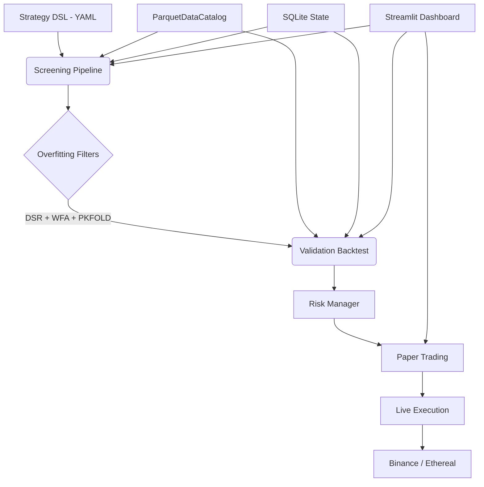

# vibe-quant

Algorithmic trading engine for crypto perpetual futures. NautilusTrader (Rust core) with two-tier backtesting, strategy DSL, overfitting prevention, and paper/live execution.

[](https://opensource.org/licenses/MIT)
[](https://www.python.org/downloads/)
[]()

---

## Why

Most backtesters lie. They ignore funding rates, assume perfect liquidity, and encourage overfitting to historical noise.

vibe-quant uses a single engine (NautilusTrader) in two modes: fast screening for parameter sweeps and full-fidelity validation with realistic execution. Leverage, funding rates, and liquidation are modeled even during screening. If a strategy survives vibe-quant, it has a fighting chance in the real world.

**Principles:**
1. Reality first -- fees, slippage, latency, funding rates, liquidation are first-class
2. Death to overfitting -- rigorous statistical validation is default, not optional
3. Code flows, money grows -- developer experience over enterprise bloat

---

## Features

### Single-Engine, Two-Tier Backtesting
- **Screening mode**: simplified fills + multiprocessing parallelism for rapid parameter sweeps. Still models leverage, funding, liquidation.
- **Validation mode**: custom FillModel (volume-based slippage), LatencyModel (1ms co-located to 200ms retail), full cost modeling.

### Strategy DSL
- Declarative YAML -- indicators + conditions + actions
- Multi-timeframe (1m, 5m, 15m, 1h, 4h confirmation)
- Time filters (session windows, funding avoidance)
- Auto-compiles to NautilusTrader `Strategy` subclasses. Same code for backtest, paper, live.

### Realistic Cost Simulation
- Maker/taker fees, volume-based slippage (square-root market impact), dynamic spreads
- Up to 20x leverage with maintenance margin tiers and liquidation
- Funding rate payments (8h Binance, 1h Ethereal)
- Network latency presets (co-located, domestic, international, retail)

### Overfitting Prevention
- **Deflated Sharpe Ratio** -- Bailey & Lopez de Prado; detects multiple-testing luck
- **Walk-Forward Analysis** -- sliding window train/test (~13 windows over 2 years)
- **Purged K-Fold CV** -- cross-validation with purge gaps to prevent data leakage
- Each filter independently toggleable

### Position Sizing & Risk
- Kelly Criterion, Fixed Fractional, ATR-based sizing (pluggable modules)
- Strategy-level circuit breakers (drawdown, daily loss, consecutive losses)
- Portfolio-level risk limits (total exposure, correlated positions)

### Execution
- **Binance Futures**: USDT-M perpetuals via NautilusTrader adapter
- **Ethereal DEX**: custom adapter with EIP-712 signed authentication
- **Paper trading**: NautilusTrader TradingNode on Binance testnet

### Automated Strategy Discovery
- Genetic/evolutionary optimization discovers indicator combos
- Strategy genome: chromosomes of (indicator, parameter, condition) genes
- Multi-objective Pareto ranking with complexity penalty
- Overfitting-aware -- DSR correction for total candidates tested

### Dashboard
- Streamlit UI: strategy management, backtest launch, results analysis, paper trading monitor
- Pareto front scatter plots, equity curves, drawdown charts, monthly returns heatmaps
- Background job management with heartbeat tracking

---

## Tech Stack

| Layer | Technology |
|-------|-----------|
| Language | Python 3.13 (via `uv`) |
| Engine | NautilusTrader ~1.222.x (Rust core) |
| Indicators | NautilusTrader built-in (Rust) + pandas-ta-classic |
| Market Data | NautilusTrader ParquetDataCatalog (Apache DataFusion) |
| Raw Archive | SQLite (immutable CSV/API data archive) |
| State | SQLite (WAL mode) -- configs, results, trade logs |
| Analytics | DuckDB (ad-hoc queries on Parquet + SQLite) |
| Dashboard | Streamlit + Plotly |
| Alerts | Telegram Bot API |

---

## Getting Started

### Prerequisites

- Python 3.13+
- [`uv`](https://docs.astral.sh/uv/) package manager

### Install

```bash
git clone https://github.com/verebelyin/vibe-quant.git
cd vibe-quant
uv pip install -e ".[dev]"
```

### Download Market Data

```bash
# Download 2 years of OHLCV + funding rates for BTC, ETH, SOL
vibe-quant data ingest --symbols BTCUSDT,ETHUSDT,SOLUSDT --years 2

# Verify data quality
vibe-quant data status
```

### Run a Screening Sweep

```bash
# Create a strategy run in the database, then screen it
vibe-quant screening --run-id 1
```

Or use the dashboard for a GUI workflow:

```bash
streamlit run vibe_quant/dashboard/app.py
```

### Run Tests

```bash
pytest
ruff check
mypy vibe_quant/
```

---

## Architecture

See [docs/architecture.md](docs/architecture.md) for detailed architecture documentation.

```
Strategy DSL (YAML) -> Screening (NT simplified, parallel) -> Overfitting Filters -> Validation (NT full fidelity) -> Paper -> Live
```



---

## Project Structure

```
vibe_quant/
├── data/           # Data ingestion, archival, catalog management
├── db/             # SQLite state management (WAL mode)
├── dsl/            # Strategy DSL parser, validator, compiler
├── screening/      # Parameter sweep pipeline (multiprocessing)
├── validation/     # Full-fidelity backtesting (custom fills, latency)
├── overfitting/    # DSR, Walk-Forward, Purged K-Fold filters
├── risk/           # Position sizing, risk actors, circuit breakers
├── discovery/      # Genetic/evolutionary strategy optimizer
├── paper/          # Paper trading on Binance testnet
├── ethereal/       # Ethereal DEX adapter (EIP-712)
├── dashboard/      # Streamlit UI (7 pages)
├── jobs/           # Background job management
├── logging/        # Structured event logging
├── alerts/         # Telegram notifications
└── strategies/     # Example YAML strategies
```

---

## CLI

```bash
# Data management
vibe-quant data ingest --symbols BTCUSDT,ETHUSDT,SOLUSDT --years 2
vibe-quant data status

# Screening (parameter sweep)
vibe-quant screening --run-id <N>

# Validation (full-fidelity backtest)
vibe-quant validation run --run-id <N> --latency retail

# Overfitting filters
python -m vibe_quant.overfitting run --run-id <N> --filters wfa,dsr,pkfold

# Paper trading
python -m vibe_quant.paper --config paper_config.json

# Dashboard
streamlit run vibe_quant/dashboard/app.py
```

---

## Roadmap

Development follows an 8-phase plan detailed in [`SPEC.md`](SPEC.md).

- [x] **Phase 1**: Foundation & Data Layer -- ingestion, archival, ParquetDataCatalog
- [x] **Phase 2**: Strategy DSL & Screening Pipeline -- YAML parser, compiler, parallel sweeps
- [x] **Phase 3**: Validation Backtesting & Risk -- custom fills, latency, sizing, risk actors
- [x] **Phase 4**: Overfitting Prevention -- DSR, Walk-Forward, Purged K-Fold
- [x] **Phase 5**: Streamlit Dashboard -- full lifecycle UI
- [x] **Phase 6**: Paper Trading & Alerts -- Binance testnet, Telegram
- [x] **Phase 7**: Ethereal DEX Integration -- custom adapter, EIP-712
- [x] **Phase 8**: Automated Strategy Discovery -- genetic optimization

---

## Disclaimer

**Risk Warning:**
Trading cryptocurrencies with leverage involves high risk. Leverage can work against you as well as for you.

**Software Disclaimer:**
`vibe-quant` is open-source software for educational and research purposes only.
1. **No Financial Advice:** Nothing in this repository constitutes financial advice.
2. **Simulation vs. Reality:** Paper trading results have inherent limitations beyond programmed models.
3. **Use at Your Own Risk:** The authors accept no liability for any loss or damage arising from use of this software.

*Never risk more than you can afford to lose.*
