```mermaid
graph TD
    A[📝 Strategy DSL - YAML] --> B(🔍 Screening Pipeline)
    B --> C{🛡️ Overfitting Filters}
    C -- DSR + WFA + PKFOLD --> D(✅ Validation Backtest)
    D --> E[⚖️ Risk Manager]
    E --> F[📄 Paper Trading]
    F --> G[🚀 Live Execution]
    G --> H[Binance / Ethereal]

    I[💾 ParquetDataCatalog] --> B
    I --> D
    J[🗄️ SQLite State] --> B
    J --> D
    K[📈 Streamlit Dashboard] --> B
    K --> D
    K --> F
```

# 🌊 vibe-quant

**The high-performance algorithmic trading engine built on rigorous math, realistic simulation, and pure vibes.**

[](https://opensource.org/licenses/MIT)
[](https://www.python.org/downloads/)
[]()
[]()

---

## 🚀 The Mission

**Most backtesters lie to you.** They ignore funding rates, assume perfect liquidity, and encourage overfitting strategies to historical noise.

**vibe-quant** is an institutional-grade framework designed to be brutally honest. It uses a single engine — **NautilusTrader** (Rust core) — in two modes: fast screening for parameter sweeps and full-fidelity validation with realistic execution. If a strategy survives `vibe-quant`, it stands a fighting chance in the real world.

**Core Philosophy:**
1. 🧘 **Code flows, money grows.** (Developer experience > Enterprise bloat)
2. 🎯 **Reality first.** (Fees, slippage, latency, funding rates, and liquidation are first-class citizens)
3. 🛡️ **Death to overfitting.** (Rigorous statistical validation is default, not optional)

---

## ✨ Key Features

### 🏗️ Single-Engine, Two-Tier Architecture
* **Screening Mode:** NautilusTrader with simplified fills + multiprocessing parallelism for rapid parameter sweeps — still models leverage, funding rates, and liquidation.
* **Validation Mode:** Full-fidelity NautilusTrader with custom `FillModel` (volume-based slippage), `LatencyModel` (co-located 1ms → retail 200ms), and complete cost modeling.

### 📝 Strategy DSL
* **Declarative YAML** — define strategies as Indicator + Condition + Action combos.
* **Multi-timeframe** — 1m, 5m, 15m, 1h, 4h confirmation signals.
* **Time filters** — restrict trading to specific sessions/timezones.
* **Auto-compilation** — DSL compiles to NautilusTrader `Strategy` subclasses. Same code for backtest, paper, and live.

### 💸 Realistic Simulation (The "Anti-Rekt" Layer)
* **True Cost Analysis:** Maker/taker fees, volume-based slippage (square-root market impact), dynamic spreads.
* **Leverage Logic:** Native support for up to **20x leverage** with:
    * Maintenance margin tiers and liquidation price calculation.
    * **Funding Rate Payments** (8-hour for Binance, 1-hour for Ethereal).
* **Network Latency Simulation:** NautilusTrader `LatencyModelConfig` with presets (co-located, domestic, international, retail, custom).

### 🛡️ Overfitting Prevention Pipeline
* **Deflated Sharpe Ratio (DSR):** Bailey & Lopez de Prado formula — determines if your Sharpe is skill or multiple-testing luck.
* **Walk-Forward Analysis:** Sliding window train/test (9m/3m/1m default → ~13 windows over 2 years).
* **Purged K-Fold CV:** Cross-validation with purge gaps to prevent data leakage. Each filter independently toggleable.

### ⚡ Execution & Connectors
* **Binance Futures:** Full USDⓈ-M Perpetual support via NautilusTrader adapter.
* **Ethereal DEX:** Custom adapter with **EIP-712** signed authentication (Phase 7).
* **Paper Trading:** NautilusTrader `TradingNode` on Binance testnet — **zero code changes** from backtest to live.
* **Bankroll Management:** Kelly Criterion, Fixed Fractional, and ATR volatility sizing (pluggable `PositionSizer` modules).

### 🧬 Automated Strategy Discovery (Phase 8)
* **Genetic/Evolutionary Optimization** — automatically discovers indicator combos.
* **Strategy genome** — chromosomes of (indicator, parameter, condition) genes.
* **Multi-objective fitness** — Pareto ranking on Sharpe, MaxDD, Profit Factor with complexity penalty.
* **Overfitting-aware** — DSR correction for total candidates tested, WFA required for final promotion.

---

## 🛠️ Tech Stack

| Layer | Technology |
|-------|-----------|
| 🐍 **Language** | Python 3.13 (via `uv`) |
| ⚙️ **Engine** | NautilusTrader ~1.222.x (Rust core) |
| 📊 **Indicators** | NautilusTrader built-in (Rust) + pandas-ta-classic |
| 💾 **Market Data** | NautilusTrader ParquetDataCatalog (Apache DataFusion) |
| 🗄️ **Raw Archive** | SQLite (immutable CSV/API data archive) |
| 📋 **State** | SQLite (WAL mode) — configs, results, trade logs |
| 🔍 **Analytics** | DuckDB (ad-hoc queries on Parquet + SQLite) |
| 📈 **Dashboard** | Streamlit + Plotly |
| 📱 **Alerts** | Telegram Bot API |

---

## 📦 Quick Start

```bash
# Clone the vibes
git clone https://github.com/verebelyin/vibe-quant.git
cd vibe-quant

# Install dependencies
uv pip install -e .
```

---

## 🏛️ Architecture

```
Strategy DSL (YAML) → Screening (NT simplified, parallel) → Overfitting Filters → Validation (NT full fidelity) → Paper → Live
```



---

## 📊 Analytics & Dashboard

The Streamlit dashboard provides **full lifecycle management** — from strategy creation to live monitoring.

**📈 Performance Metrics:**
* Risk-Adjusted Returns: Sharpe, Sortino, Calmar ratios
* Drawdown Analysis: Maximum Drawdown, underwater duration, recovery factor
* Trade Statistics: Win rate, profit factor, average win/loss, expectancy
* Cost Breakdown: Total fees, funding payments, slippage impact per trade

**🎨 Visualizations:**
* 📈 Interactive equity curve (log vs linear, vs buy & hold)
* 🔥 Pareto front scatter plot (Sharpe vs MaxDD, color = PF)
* 📉 Underwater drawdown plot
* 📅 Monthly returns calendar heatmap
* 📊 Parameter sweep heatmaps (detect fragile strategies)

**🛡️ Overfitting Detection:**
* DSR p-value badges per strategy
* Walk-Forward efficiency: IS vs OOS performance comparison
* Purged K-Fold consistency scores

---

## 🗺️ Roadmap

Development follows an **8-phase implementation plan** detailed in [`SPEC.md`](SPEC.md).

- [ ] **Phase 1: Foundation & Data Layer**
    - Project skeleton, data ingestion with raw archival
    - ParquetDataCatalog: 3 symbols × 2 years × 5 timeframes
    - SQLite state database (WAL mode)

- [ ] **Phase 2: Strategy DSL & Screening Pipeline**
    - YAML DSL parser with multi-TF and time filter support
    - DSL-to-NautilusTrader Strategy compiler
    - Parallel parameter sweeps via multiprocessing
    - Pareto front ranking (Sharpe, MaxDD, Profit Factor)

- [ ] **Phase 3: Validation Backtesting & Risk**
    - Custom FillModel (volume-based slippage)
    - LatencyModel presets (1ms → 200ms)
    - Position sizing modules (Kelly, Fixed Fractional, ATR)
    - Strategy + portfolio level risk circuit breakers

- [ ] **Phase 4: Overfitting Prevention Pipeline**
    - Deflated Sharpe Ratio (Bailey & Lopez de Prado)
    - Walk-Forward Analysis (~13 windows over 2 years)
    - Purged K-Fold Cross-Validation (K=5)
    - Toggleable filter chain

- [ ] **Phase 5: Streamlit Dashboard**
    - Full lifecycle UI: create strategies, launch sweeps, analyze results
    - Auto-generated parameter forms from DSL schema
    - Background backtest management with progress tracking

- [ ] **Phase 6: Paper Trading & Alerts**
    - NautilusTrader TradingNode on Binance testnet
    - State persistence and crash recovery (SQLite)
    - Telegram alerts (errors, circuit breakers, daily P&L summary)

- [ ] **Phase 7: Ethereal DEX Integration**
    - Custom NautilusTrader adapter (EIP-712 signing)
    - 1-hour funding intervals, 0%/0.03% maker/taker fees
    - Testnet paper trading support

- [ ] **Phase 8: Automated Strategy Discovery**
    - Genetic/evolutionary algorithm for strategy generation
    - Multi-objective fitness with complexity penalty
    - Full overfitting pipeline integration
    - Dashboard: real-time evolution progress visualization

---

## ⚠️ Disclaimer

**Risk Warning:**
Trading cryptocurrencies, specifically with leverage, involves a high level of risk and may not be suitable for all investors. The high degree of leverage can work against you as well as for you. Before deciding to trade, you should carefully consider your investment objectives, level of experience, and risk appetite.

**Software Disclaimer:**
`vibe-quant` is open-source software for educational and research purposes only.
1. **No Financial Advice:** Nothing in this repository constitutes financial advice.
2. **Simulation vs. Reality:** Paper trading results have inherent limitations. They do not account for the full impact of liquidity on execution (market impact) beyond the programmed models, nor do they account for hardware failures or network latency spikes beyond configured presets.
3. **Use at Your Own Risk:** The authors and contributors accept no liability for any loss or damage, including without limitation to, any loss of profit, which may arise directly or indirectly from use of or reliance on this software.

*Never risk more than you can afford to lose.*
